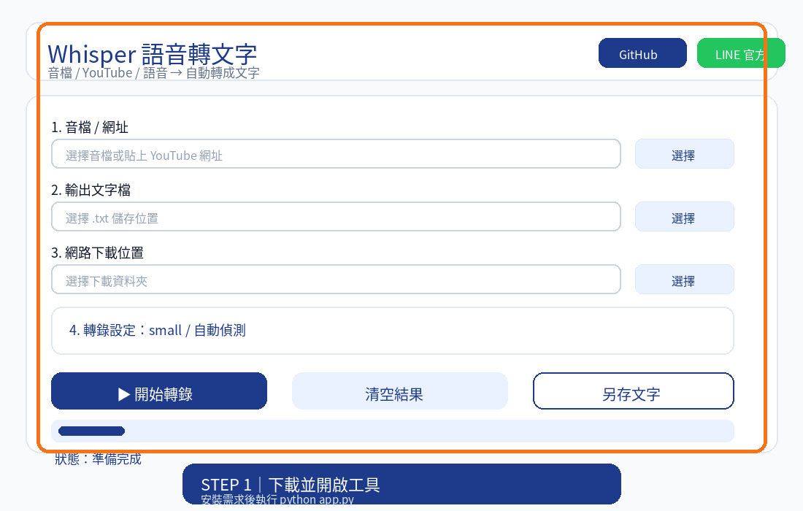

# 🎙 Whisper 語音轉文字

使用 OpenAI Whisper 在自己的 Windows 電腦上將音訊轉成文字，支援本機音檔與 YouTube 網址，並可輸出 UTF-8 的 `.txt` 檔。

> 轉錄在你的電腦上執行。第一次使用所選 Whisper 模型時，程式會下載模型檔，請保持網路連線；模型檔大小依模型而異。

## 功能

- 支援 mp3、mp4、wav、m4a、aac、flac、ogg、wma、webm 等音訊或影片檔
- 可貼上 YouTube 網址下載音訊後轉錄
- 可選擇 tiny、base、small、medium、large 模型及辨識語言
- 即時顯示結果，並儲存或另存為文字檔

📌 30 秒快速了解操作方式



## Windows 快速安裝

### 安裝前準備

- Windows 10 或 Windows 11
- Python 3.10 或 3.11（安裝時勾選 **Add Python to PATH**）
- FFmpeg（本機音檔與 YouTube 轉錄都需要）
- Node.js LTS（只有使用 YouTube 網址時需要）

### 安裝步驟

1. 在本頁按 **Code → Download ZIP**，下載並解壓縮專案。
2. 雙擊資料夾中的 `install_windows.cmd`。
3. 安裝器會建立專案專用的 `.venv`、安裝 `requirements.txt` 中的套件，並建立桌面與開始功能表捷徑。
4. 安裝完成後，雙擊桌面的 **Whisper Transcriber** 捷徑，或執行 `START_WHISPER.cmd` 開啟原有操作面板。

安裝時需要網路下載 Python 套件，可能需要幾分鐘。若 Windows 顯示安全提示，請先確認檔案是從本專案下載後再執行。批次安裝檔只使用 ASCII 文字，避免繁體中文被 CMD 用錯誤編碼讀取。

### FFmpeg 設定

FFmpeg 是音訊解碼所需工具，安裝器會檢查它是否已可在命令列使用，但不會替你安裝。請依照 [FFmpeg Windows builds](https://www.gyan.dev/ffmpeg/builds/) 下載並安裝，然後在新的 CMD 視窗輸入：

```bat
ffmpeg -version
```

若 CMD 顯示版本資訊，即可使用。若仍提示找不到指令，請確認 FFmpeg 的 `bin` 資料夾已加入 PATH，重新開啟 CMD 後再試。

### YouTube 網址設定

使用 YouTube 網址轉錄時，另外安裝 [Node.js LTS](https://nodejs.org/)，再於新的 CMD 視窗輸入：

```bat
node -v
```

若只處理電腦裡的音檔，可以略過 Node.js。

## CMD 手動安裝方式

如果不使用安裝器，可在專案資料夾空白處開啟 CMD，依序執行：

```bat
py -3.11 -m venv .venv
.venv\Scripts\python.exe -m pip install --upgrade pip
.venv\Scripts\python.exe -m pip install -r requirements.txt
.venv\Scripts\python.exe app.py
```

若電腦安裝的是 Python 3.10，將第一行的 `-3.11` 改成 `-3.10`。手動方式也需要先安裝 FFmpeg；YouTube 網址另需 Node.js。

## 操作方式

1. 在「音檔 / 網址」選擇本機音檔，或貼上 YouTube 網址。
2. 選擇文字檔輸出位置。
3. 選擇模型與語言。
4. 按「開始轉錄」並等待完成。

首次使用 Whisper 模型會下載模型資料；較大的模型需要更多下載時間、記憶體與處理時間。

## 常見問題

### 安裝器視窗很快關閉，或顯示 Python 未找到

請安裝 Python 3.10 或 3.11，安裝時勾選 **Add Python to PATH**，再重新執行 `install_windows.cmd`。也可以用 CMD 手動安裝。

### 安裝套件失敗

確認網路正常、Python 版本是 3.10 或 3.11，再重新執行安裝器。安裝器會沿用已建立的 `.venv`，不會修改 `app.py`。

### 程式提示找不到 FFmpeg

在 CMD 執行 `ffmpeg -version`。若找不到，請安裝 FFmpeg 並把其 `bin` 資料夾加入 PATH，然後重新開啟程式。

### YouTube 轉錄失敗

確認已安裝 Node.js LTS，並在新的 CMD 執行 `node -v)。YouTube 網站端的變更也可能影響下載功能。

### 第一次轉錄等待較久

程式正在下載所選的 Whisper 模型。保持網路連線並等待下載完成即可。

## 專案檔案

- `app.py`：原有 Whisper 桌面操作面板
- `install_windows.cmd`：Windows 依賴安裝與捷徑建立
- `START_WHISPER.cmd`：啟動原有操作面板
- `create_shortcut.ps1`：建立桌面與開始功能表捷徑
- `requirements.txt`：Python 套件清單

## 作者與支持

GitHub：[dw5000tw-33](https://github.com/dw5000tw-33)

如果這個工具對你有幫助，歡迎自由支持後續開發與維護。支持完全自願，不影響工具的免費使用。

[透過綠界支持 33 Works](https://p.ecpay.com.tw/304E8B5)
